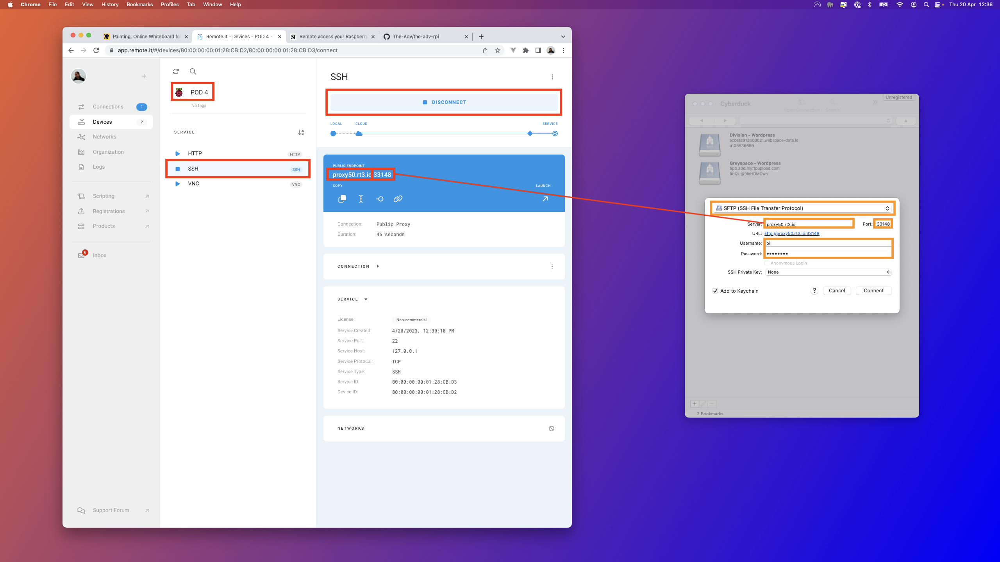
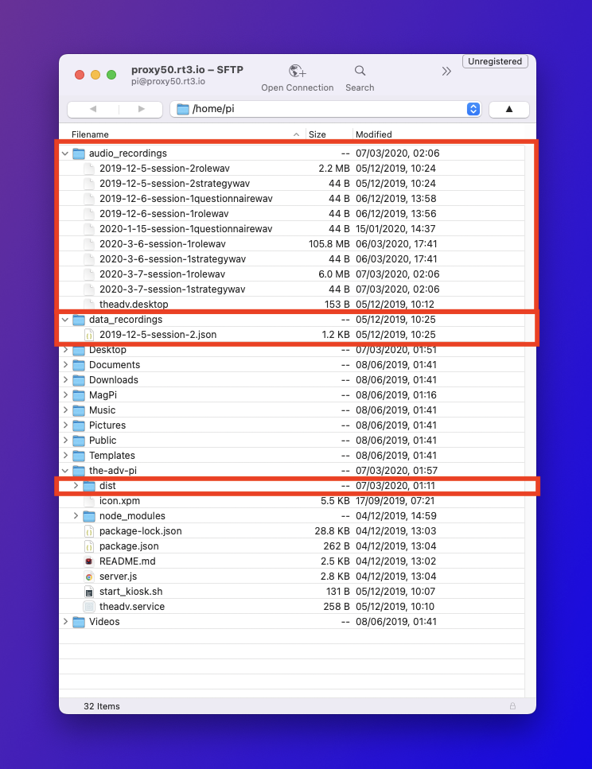

# How to Install and Run the Project

## Format a new SD Card

1. On a Mac/PC plug in the SD card and download the [Raspberry Pi OS Imager](https://www.raspberrypi.com/software/) app and install Rasbien 64-bit

## Install and setup the pod

2. Plug the newly formatted SD card into the Raspberry Pi and turn on. You will be asked a few setup questions the first time your turn on the Pi.

3. **Create an account.** Username: 'pi', Password: 'THE_ADV$'

4. **Add the PI to remote.it** Follow the instructions [here](https://magpi.raspberrypi.com/articles/remote-access-your-raspberry-pi-securely) to add the new rpi to the remote.it account. The rest of the process can then mostly be completely remotely from another computer using terminal and cyberduck. Below is a quick summary:

   - To connect remotely, SSH and VNC must be activated on Raspberry Pi. Click on the main menu and choose Preferences > Raspberry Pi Configuration. Choose the Interfaces tab and set both SSH and VNC to Enabled.

   - Open a terminal window and type `sudo apt install remoteit`

   - Open the web browser on your Raspberry Pi and navigate to http://find.remote.it. Log in to your remote.it account and register the new device using the name of the pod 'POD 1'.

## Connecting remotely to continue/setup

On the remote.it website select the POD, click SSH and then click connect. Then use those connection details in cyberduck to connect remotely to the POD.



You can download/upload any files using cyberduck. Once you’ve made any changes you will need to restart the Raspberry Pi to see them.



5. **Update RPi packages.** Open terminal and type `sudo apt update` then press 'enter'. You will be asked for the password, but no letters will show on the screen so you type it blind – then press 'enter'. Once this is finished you should update the next set of code, in terminal type `sudo apt-get update` and follow the same process as before with your password.

6. **Stop screen from sleeping.** Open terminal and type `sudo nano /etc/lightdm/lightdm.conf` and press 'enter' to open the config file, you will be asked to enter your password. Scroll down until you see all the lines starting with 'xserver–' and add the follow on a new line `xserver-command=X -s 0 dpms`. When ready press 'ctrl' + 'x' to exit, you will be asked to 'save modifed buffer?', type 'y', you will be asked if you want to keep the same file name, you do, so press enter.

## Setup hifiberry audio

7. **Enable the soundcard.** Open terminal and type `sudo nano /boot/config.txt` and press 'enter' top open the pi’s config file, you will be asked to enter a password first. Scroll down the file until you find the following line `dtparam=audio=on` then disable that line by typing `#` at the start of that line. Then create a new line and type `dtoverlay=hifiberry-dacplus`. When ready press 'ctrl' + 'x' to exit, you will be asked to 'save modifed buffer?', type 'y', you will be asked if you want to keep the same file name, you do, so press enter.

8. Reboot the pi and **check that the soundcard is available.**. Open terminal and type `aplay -l` then press 'enter'. You should see of playback devices, they are labelled as cards. See which card 'sndrpihifiberry' is listed under and write it down.

9. **Configure ALSA**. Open terminal and type `sudo nano /etc/asound.conf` and press 'enter'. You will be asked for your password. You will be creating a new file with the following content. The code below assumes that 'sndrpihifiberry' was under card 0, if you listed any other number in the previous step, replace '0' with that number.

```
pcm.!default  {
 	type hw card 0
}
ctl.!default {
 	type hw card 0
}
```

When ready press 'ctrl' + 'x' to exit, you will be asked to 'save modifed buffer?', type 'y', you will be asked if you want to keep the same file name, you do, so press enter. Then Reboot the rpi.

## Setup the microphone

To install the settings panel for the microphone (it’s not available by default) you need to install pimixer. Open a new terminal window and type `sudo apt install -y pimixer`.

To open the controls from use the preferences panel in the main RaspberryPi menu or typing `pimixer` into a terminal window. You should then see the controls from the 'Samsung' device that is the microphone. Make sure the slider is at the top (maximum) and then save any changes.

## Install Node & NPM

10. **Download and install node and NPM.** To donwload and install open terminal and enter the follow lines, one by one. Press enter after each one, because each line is a command.

```
sudo npm cache clean -f
sudo npm install -g n
sudo n stable
```

~~If the download does not work you might need to download a version of node first `curl -sL https://deb.nodesource.com/setup_16.x | sudo bash -`~~

10. **Check if the installation was successful.** Open terminal and type `node -v` and press 'enter'. You should see 'node' followed by the version number for example 'v16.17.0'.

## Install the project folder on the Pi

11. **Download the project files from Github and install the project.** Open terminal move to the 'pi' home folder in terminal and clone 'the-adv-pi' files onto the pi from Gitlab `git clone https://github.com/The-Adv/the-adv-rpi.git`

12. **Install the project files.** Open terminal in the project folder and run `npm install` to download project dependencies

13. **Install the latest version of the app.** This code just makes a website run automatically and sets up the Raspberry Pi. The files for the actual experience need to be downloaded seperately.

    - Download the latest version of the experience [here (1+gb zip file)](https://github.com/The-Adv/the-adv-rpi-app/releases/latest/download/dist.zip).

    - Unzip the file and copy the entire 'dist' folder in to this projects 'the-adv-pi' folder, replacing any existing 'dist' folder that’s already there.

14. run `npm run start` to test that node is working

15 Make executable '/home/pi/start_kiosk.sh' (permissions)

## Run the project automatically

16. Remember the location that node was installed `which node` and update the ExecStart command in 'theadv.service' file.

17. Run node automatically: Copy the service to the systemd folder `sudo cp theadv.service /etc/systemd/system` and then enable the service `sudo systemctl enable theadv.service` the `sudo reboot`

18. Create a link to the 'audio_recordings' & 'data_recordings' & 'The Adv' by selecting each file individually and from the 'Edit' menu click 'Create Link' and add browse to the desktop to save the shortcut.

## Test the app

19. Reboot & test the app from the desktop shortcut. Create some audio recordings by jumping to the strategy section and save the data from the operator page.

# Updating the app

Any updates to the app content must be done seperately because the code for the app is in another gitlab project. It is very unlikely that the code in this repository will need to be updated frequently.
